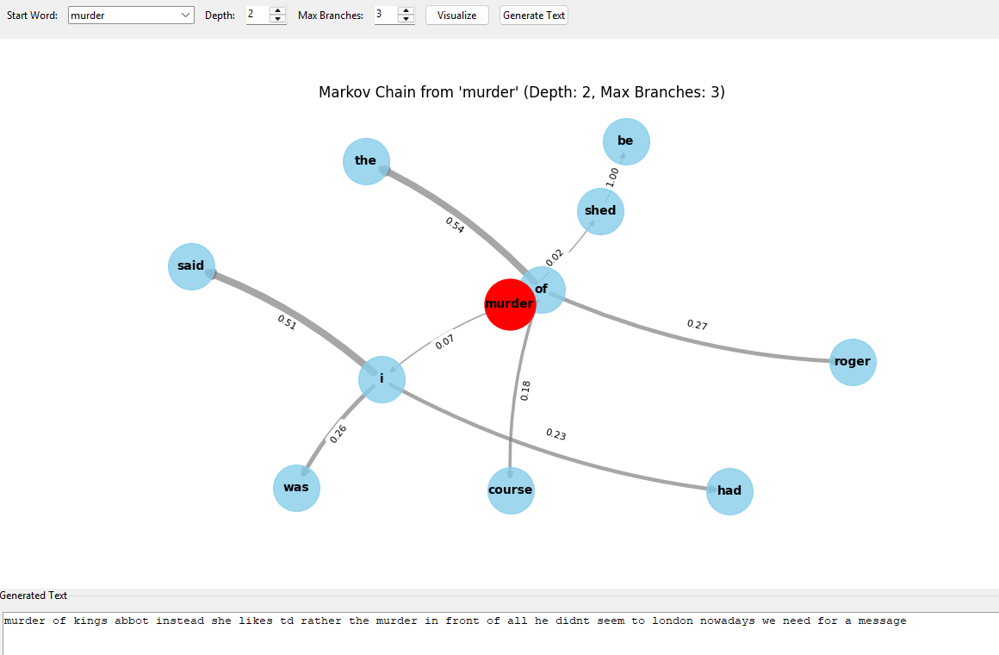
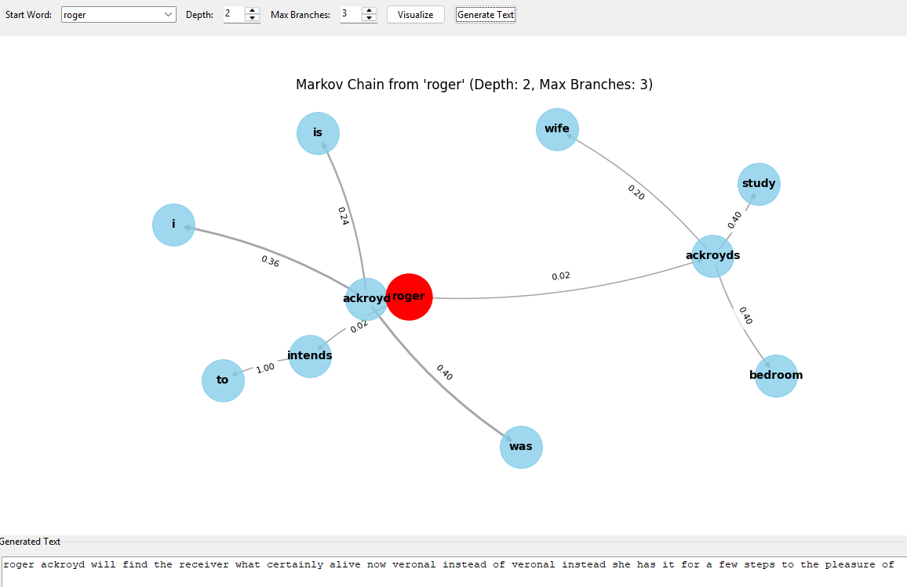

# Markov Chain Text Generation
`markov_textGen` is a simple text generation tool based on Markov chains. Markov chains are mathematical systems that transition from one state to another, where the next state depends only on the current state. In text generation, this means the next word or phrase is chosen based on the previous word(s), allowing the creation of new, coherent sentences that mimic the style of the original text.

This generator is trained on *The Murder of Roger Ackroyd* novel, so the generated text will reflect the vocabulary and style of that book.




## Example Text Generations
### Example 1
``` python
number of lines =  3258
number of words =  27499
Enter the n-gram order (default is 3, max 5): 2
number of states in the Markov model =  16426
Enter a start word (default is 'the murder'): was seen
```
Generated Text: was seen in neighborhood of fernly park my neighbor made a slight gesture of impatience of course i should have been forced to tell any one else but none of the people who make it their business to be and i shut 
### Example 2
```python
number of lines =  3258
number of words =  27499
Enter the n-gram order (default is 3, max 5): 3
number of states in the Markov model =  24846
Enter a start word (default is 'the murder of'): the murder of
```
Generated Text: the murder of roger ackroyd nouncements beginning with her favorite words of course an old woman with an immense breton cap opened the door to us his manner was smug and deferential and he seemed to have recovered from his panic of the night before colonel melrose took a key from his pocket and looked again at the scrap of white stuff inspector 
### Example 3
``` python
number of lines =  3258
number of words =  27499
Enter the n-gram order (default is 3, max 5): 5
number of states in the Markov model =  27261
Enter a start word (default is 'the murder of roger ackroyd'): 

```
Generated Text: the murder of roger ackroyd the inspector took in the position at a glance we went through into the large hall and he locked the door behind him slipping the key into his pocket then he gave the constable some instructions and the latter prepared to depart we must get busy on those shoe tracks explained the inspector but first of all i must have a word with miss ackroyd she was the last person to see her uncle alive does she know yet raymond shook his head well no need to tell her for another five minutes she can answer my questions better without 